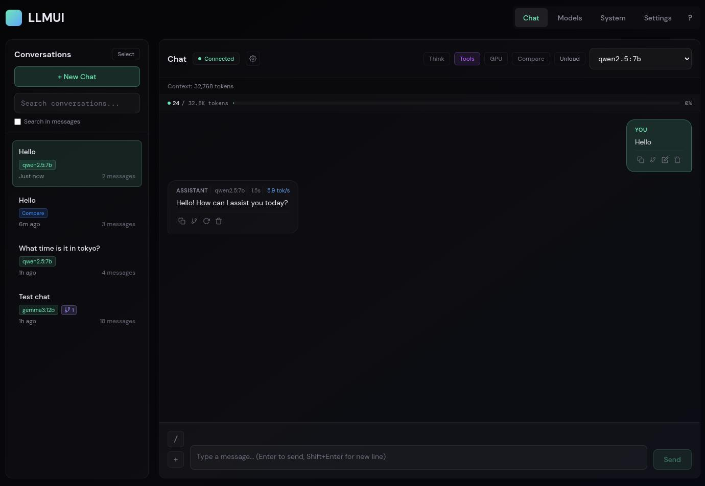

# LLMUI

A web interface for chatting with local LLMs through Ollama.



## What it does

- **Chat** with any model you have installed in Ollama
- **Compare models** - send the same prompt to 2-4 models and see responses side-by-side
- **Pull and delete models** directly from the UI
- **GPU monitoring** - see your VRAM usage, temperature, utilization in real-time (NVIDIA only)
- **Conversation history** - stored in SQLite at `~/.llmui/` with full-text search
- **Hardware guide** - helps figure out what models will run on your system
- Configurable system prompts, temperature, max tokens

## Requirements

- [Node.js](https://nodejs.org/) (v18 or higher)
- [Ollama](https://ollama.ai/) running locally

For GPU stats you'll need an NVIDIA GPU with drivers installed. If you don't have one, the app still works fine - you just won't see the GPU panel.

## Installation

### Linux

1. Install Node.js (if not already installed):
   ```bash
   # Ubuntu/Debian
   curl -fsSL https://deb.nodesource.com/setup_20.x | sudo -E bash -
   sudo apt install -y nodejs

   # Fedora
   sudo dnf install nodejs

   # Arch
   sudo pacman -S nodejs npm
   ```

2. Install Ollama:
   ```bash
   curl -fsSL https://ollama.com/install.sh | sh
   ```

3. Clone and install:
   ```bash
   git clone <repo-url>
   cd llmui
   npm install
   ```

### Windows

1. Install Node.js:
   - Download from [nodejs.org](https://nodejs.org/) and run the installer
   - Or use winget: `winget install OpenJS.NodeJS`

2. Install Ollama:
   - Download from [ollama.com](https://ollama.com/download) and run the installer

3. Clone and install (in PowerShell or Command Prompt):
   ```powershell
   git clone <repo-url>
   cd llmui
   npm install
   ```

## Running

### Linux

Start Ollama (if not running as a service):
```bash
ollama serve
```

Then start the UI:
```bash
npm run dev
```

### Windows

Ollama runs automatically after installation. If needed, start it from the Start Menu.

Then start the UI (in PowerShell or Command Prompt):
```powershell
npm run dev
```

Open http://localhost:3000 in your browser. This runs both the storage server (port 3001) and the frontend (port 3000).

## Configuration

Most settings can be changed in the Settings tab:

- **Ollama URL** - defaults to `http://localhost:11434`, change it if your Ollama server is running somewhere else
- **System Prompt** - gets sent at the start of every conversation
- **Temperature** - lower = more focused, higher = more creative
- **Max Tokens** - limit on response length

### Compare Mode

Compare mode lets you send the same prompt to 2-4 models simultaneously and view their responses side-by-side. Click the "Compare" toggle in the chat header to enable it.

For optimal parallel inference performance, set the `OLLAMA_NUM_PARALLEL` environment variable to match the maximum number of models you want to compare at once (Ollama's default is 1):

```bash
# Linux/macOS
OLLAMA_NUM_PARALLEL=4 ollama serve

# Or set it in your environment
export OLLAMA_NUM_PARALLEL=4
```

Without this setting, Ollama will swap models in and out of GPU memory sequentially, which significantly reduces the parallelism benefit. The UI will show a warning if your selected models' combined VRAM exceeds your GPU capacity.

## Data storage

All data is stored locally in `~/.llmui/`:

- **Database**: `llmui.db` - SQLite database (WAL mode) containing conversations, messages, and settings
- **Auth token**: `token` - bearer token for API authentication
- **Backups**: `backups/` - database backups created via the API

### Migration from JSON

If you're upgrading from a previous version that used JSON files, the server automatically migrates your data to SQLite on first startup. Your original JSON files are preserved in `~/.llmui/legacy_backup_<timestamp>/`.

To preview what will be migrated without making changes:
```bash
node server/index.js --dry-run
```

### Full-text search

The database includes FTS5 full-text search across all messages. Search endpoint:
```
GET /api/search?q=<query>&conversation_id=<optional>
```

### Backup

Create a database backup:
```bash
curl -X POST -H "Authorization: Bearer $(cat ~/.llmui/token)" http://localhost:3001/api/backup
```

Backups are stored in `~/.llmui/backups/`.

## Authentication & LAN Access

The storage server uses bearer token authentication to protect your data. A token is automatically generated on first run and stored at `~/.llmui/token` (mode 0600).

**LAN Access**: To access LLMUI from other devices on your network, add your server's LAN IP to the allowed origins:

```bash
LLMUI_ALLOWED_ORIGINS="http://192.168.1.100:3000" npm run dev
```

Multiple origins can be comma-separated.

**Production Deployment Note**: The current token delivery mechanism (via Vite plugin at `/api/llmui-token`) only works during development. For production deployment after `vite build`, you'll need to serve `dist/` from the Express server and have it inject the token into `index.html` at serve time, or use a reverse proxy that handles token injection.

## Keyboard shortcuts

Press `Ctrl+/` (or `Cmd+/` on Mac) to see all shortcuts.
